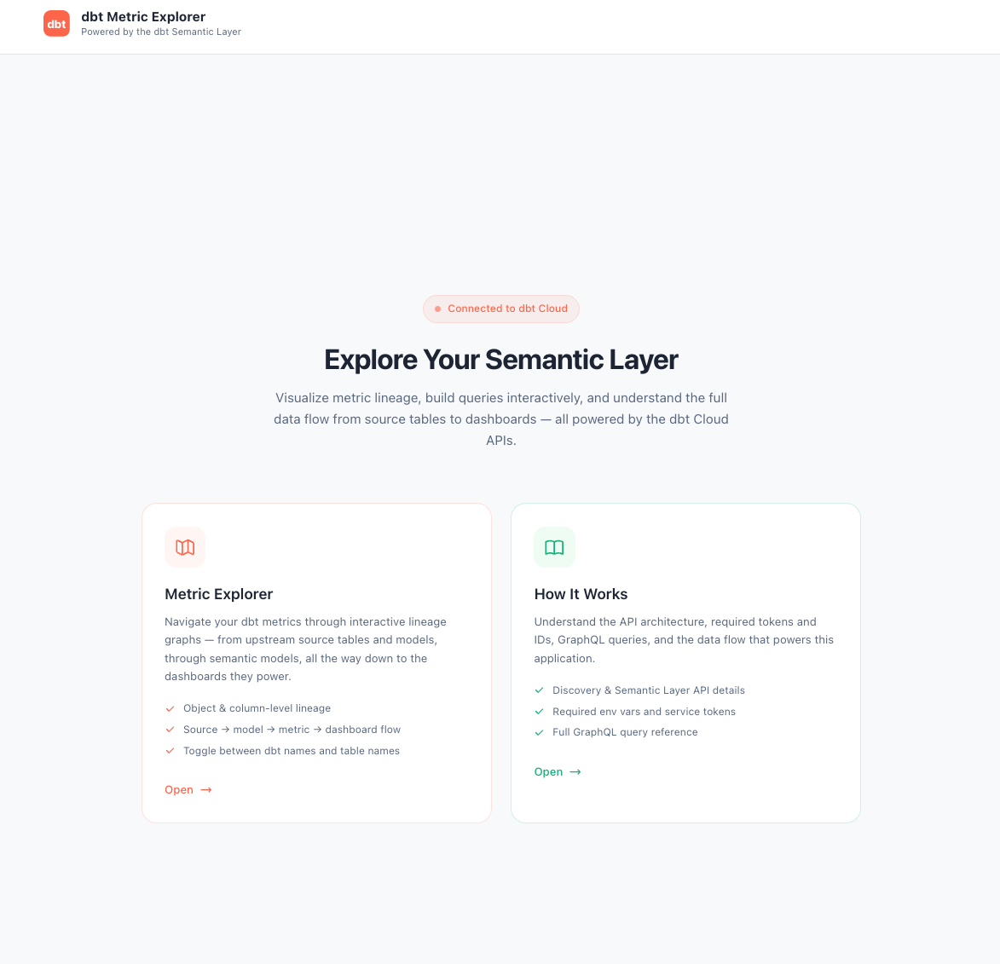
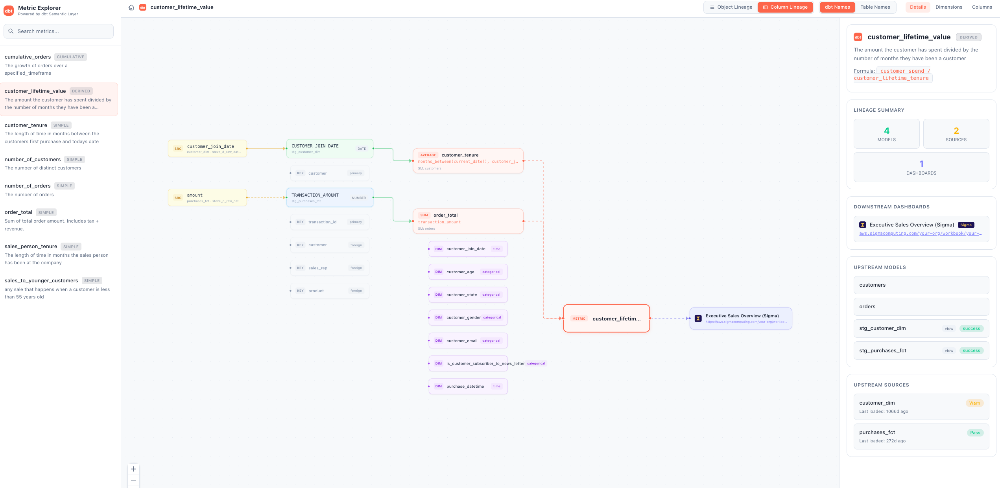

# dbt Metric Explorer

A web application for exploring dbt semantic metrics, visualizing lineage graphs, and querying the dbt Semantic Layer.





## What Does This App Do?

This app connects to your dbt Platform account and lets you:

- **Metric Explorer** — Browse every metric in your dbt project and see interactive lineage graphs showing exactly how data flows from source tables through models and semantic models, all the way to the dashboards that consume them. Supports both object-level and column-level lineage.
- **Query Lab** — Pick a metric and dimensions from dropdowns, see a live sample of actual data from the Semantic Layer, view the compiled SQL, and trace the full column-level lineage in real time.
- **How It Works** — An in-app reference page that documents every API call, required credentials, and the architecture behind the scenes.

---

## Quick Start

The fastest way to get running. You'll need [Node.js](https://nodejs.org) 18+ installed.

```bash
git clone <repo-url>
cd dbt-metric-explorer
npm run setup
```

The setup wizard will:

1. Prompt you for your dbt Platform credentials (service token, account/project/environment IDs)
2. Write them to `.env.local`
3. Install all dependencies
4. Offer to start the app immediately

Once running, open **http://localhost:3000** in your browser.

> **Already set up?** Just run `npm run dev` to start the app. Run `npm run setup` again any time to update your credentials.

---

## Prerequisites

This app requires **Node.js** (version 18 or higher). If you don't have it installed:

1. Go to [https://nodejs.org](https://nodejs.org)
2. Download the **LTS** version (the big green button)
3. Run the installer and follow the prompts
4. Verify it worked:

```bash
node -v
```

You should see something like `v20.x.x` or `v22.x.x`.

> **How to open a terminal:**
> - **Mac**: Open the "Terminal" app (search for it in Spotlight with Cmd+Space)
> - **Windows**: Open "Command Prompt" or "PowerShell" from the Start menu
> - **VS Code / Cursor**: Use the built-in terminal (Ctrl+` or Cmd+`)

---

## Manual Setup (Alternative)

If you prefer to set things up manually instead of using `npm run setup`:

### 1. Download and install dependencies

```bash
git clone <repo-url>
cd dbt-metric-explorer
npm install
```

### 2. Configure dbt Platform credentials

Copy the example config file:

**Mac / Linux:**
```bash
cp .env.local.example .env.local
```

**Windows:**
```bash
copy .env.local.example .env.local
```

Open `.env.local` in any text editor and fill in your values:

```
DBT_SERVICE_TOKEN=dbtc_abc123xyz456def789...
DBT_ACCOUNT_ID=541142
DBT_PROJECT_ID=987654
DBT_ENVIRONMENT_ID=501467
DBT_DISCOVERY_API_URL=https://metadata.cloud.getdbt.com/graphql
DBT_SEMANTIC_LAYER_API_URL=https://semantic-layer.cloud.getdbt.com/api/graphql
```

### 3. Start the app

```bash
npm run dev
```

Open **http://localhost:3000** in your browser.

---

## Where to Find Your Credentials

**`DBT_SERVICE_TOKEN`** — Your dbt Platform service token

1. Log in to [dbt Platform](https://cloud.getdbt.com)
2. Click the **gear icon** in the top right → **Account Settings**
3. In the left sidebar, click **Service Tokens**
4. Click **+ New Token**, name it (e.g., "Metric Explorer"), select **"Metadata Only"** permissions
5. Click **Save** and copy the token (starts with `dbtc_`)

> You can only see the token once when you create it. If you lose it, create a new one.

**`DBT_ACCOUNT_ID`** — From the URL: `https://cloud.getdbt.com/deploy/`**`77338`**`/projects/...`

**`DBT_PROJECT_ID`** — From the URL: `https://cloud.getdbt.com/deploy/77338/projects/`**`131392`**`/...`

**`DBT_ENVIRONMENT_ID`** — Go to **Deploy** → **Environments** → click your **Production** environment. From the URL: `.../environments/`**`105436`**

> Use the **Production** environment, not development or staging. The app needs metadata from a deployed project.

**`DBT_DISCOVERY_API_URL`** and **`DBT_SEMANTIC_LAYER_API_URL`** — The defaults work for most users (multi-tenant dbt Platform). Only change these if your organization uses single-tenant or self-hosted instances.

> **Security note:** `.env.local` is in `.gitignore` and will **not** be committed to git. Your token stays on your machine only.

---

## Using the App

### Landing Page (`/`)

The home page with three cards linking to each tool. Click any card to get started.

### Metric Explorer (`/explorer`)

1. The left sidebar lists all metrics from your dbt project
2. Click any metric to see its full lineage graph
3. Use the **Object Lineage / Column Lineage** toggle to switch between views
4. Use the **dbt Names / Table Names** toggle to switch between dbt model names and actual database table names
5. Click on any node in the graph to see its details in the right panel
6. Use the **Details**, **Dimensions**, and **Columns** tabs in the right panel for more info

### Query Lab (`/query-lab`)

1. Select a metric from the dropdown at the top
2. Toggle dimensions on/off — for time dimensions, pick a granularity (DAY, WEEK, MONTH, etc.)
3. A pseudo-SQL preview shows your current query
4. Switch between tabs at the bottom:
   - **Object Lineage** — same lineage graph as the explorer
   - **Column Lineage** — field-level data flow visualization
   - **Sample Output** — click "Run Query" to get 5 rows of real data from the Semantic Layer, plus the generated SQL

### How It Works (`/how-it-works`)

Reference documentation showing every API call, the GraphQL queries used, required environment variables, and the overall architecture.

---

## App Structure

| Route | What it does |
|---|---|
| `/` | Landing page — links to all three tools |
| `/explorer` | Metric Explorer — sidebar with metrics + interactive lineage graphs |
| `/query-lab` | Query Lab — build queries, preview data, view lineage |
| `/how-it-works` | API documentation and architecture reference |

## Tech Stack

| Technology | Purpose |
|---|---|
| [Next.js](https://nextjs.org) 16 | React framework — handles both the UI and server-side API routes |
| [React Flow](https://reactflow.dev) | Renders the interactive, draggable lineage graphs |
| [dagre](https://github.com/dagrejs/dagre) | Automatically lays out graph nodes so they don't overlap |
| [Tailwind CSS](https://tailwindcss.com) 4 | Styling and theming |
| TypeScript | Type safety across the entire codebase |

## dbt Platform APIs Used

The app connects to two dbt Platform GraphQL APIs. All calls are made server-side through Next.js API routes — your service token is **never** sent to the browser.

| API | Endpoint | What it provides |
|---|---|---|
| **Discovery API** | `metadata.cloud.getdbt.com/graphql` | Project metadata — metrics, semantic models, models, sources, exposures, catalog columns, raw SQL |
| **Semantic Layer API** | `semantic-layer.cloud.getdbt.com/api/graphql` | Runtime metric definitions, queryable dimensions, granularities, and query execution for sample output |

---

## Troubleshooting

### "command not found: npm" or "command not found: node"

Node.js is not installed or not in your system PATH. Go back to [Step 1](#step-1-install-nodejs) and install it. After installing, close and reopen your terminal before trying again.

### "npm install" shows errors

Make sure you're inside the project folder when you run the command. You can verify by running `ls` (Mac/Linux) or `dir` (Windows) — you should see files like `package.json` and `README.md` in the list.

### The app starts but the metrics list is empty

- Double-check that your `DBT_SERVICE_TOKEN` is correct and hasn't expired
- Verify your `DBT_ENVIRONMENT_ID` points to a **production** environment that has had at least one successful run
- Make sure your service token has **Metadata** permissions

### "Query failed" in the Query Lab

- The **Semantic Layer** must be enabled for your dbt Platform project (this is a dbt Platform setting, not something in this app)
- Verify `DBT_SEMANTIC_LAYER_API_URL` is correct

### Port 3000 is already in use

Another process is using port 3000. Either stop that process, or the app will automatically try port 3001.

To force-kill whatever is on port 3000:

**Mac / Linux:**
```bash
lsof -ti :3000 | xargs kill -9
```

**Windows:**
```bash
netstat -ano | findstr :3000
taskkill /PID <PID_NUMBER> /F
```

Then run `npm run dev` again.

### I changed `.env.local` but the app isn't picking up the new values

Stop the app (Ctrl+C) and restart it with `npm run dev`. Environment variable changes require a restart.

### I see a blank page or an error page in the browser

Open your browser's developer tools (F12 or right-click → Inspect → Console tab) and check for error messages. Also check the terminal where you ran `npm run dev` for any server-side errors.
