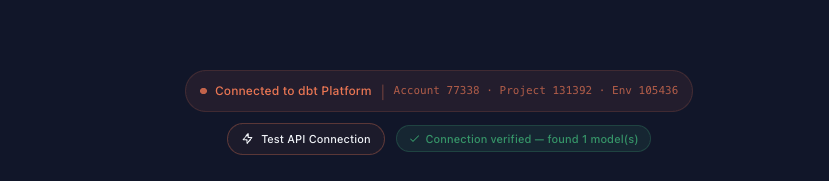

# Startup Instructions

Complete guide to getting the dbt Platform Asset Explorer running on your machine.

---

## Prerequisites

You need **Node.js version 18 or higher** installed on your machine.

### Installing Node.js

1. Go to [https://nodejs.org](https://nodejs.org)
2. Download the **LTS** version (the big green button on the homepage)
3. Run the installer — accept the defaults and click through the prompts
4. When finished, open a terminal and verify it installed correctly:

```bash
node -v
```

You should see a version number like `v20.x.x` or `v22.x.x`. Any version 18+ works.

### How to open a terminal

| Platform | How to open |
|---|---|
| **Mac** | Open the "Terminal" app (Cmd+Space, type "Terminal", press Enter) |
| **Windows** | Open "Command Prompt" or "PowerShell" from the Start menu |
| **VS Code / Cursor** | Use the built-in terminal: press Ctrl+\` (backtick) or Cmd+\` |

---

## Option A: Automated Setup (Recommended)

The interactive setup wizard handles everything in one command.

### 1. Clone the repository

```bash
git clone https://github.com/Stevedow99/dbt-metric-explorer.git
cd dbt-metric-explorer
```

If you received the project as a zip file, unzip it and open a terminal in that folder instead.

### 2. Run the setup wizard

```bash
npm run setup
```

The wizard will walk you through each step:

1. **Credentials** — It prompts you for four values from your dbt Platform account:
   - Service Token
   - Account ID
   - Project ID
   - Environment ID
2. **API URLs** — It pre-fills the standard dbt Platform API URLs. Just press Enter to accept the defaults (only change these if you use single-tenant or self-hosted dbt Platform).
3. **Config file** — It writes everything to `.env.local` (this file is git-ignored and stays on your machine only).
4. **Dependencies** — It runs `npm install` to download all required libraries.
5. **Start** — It asks if you'd like to start the app immediately.

### 3. Open the app

Once the dev server is running, open your browser to:

**http://localhost:3000**

You should see the landing page with links to the Metric Explorer, Query Lab, and other tools.

### 4. Verify your connection

Before exploring metrics or running queries, confirm that the app can successfully connect to your dbt Platform account:

1. On the home page, look for the **"Connected to dbt Platform"** section — it displays your Account ID, Project ID, and Environment ID
2. Click the **"Make test API call to confirm connection"** button
3. You should see a green success message confirming the connection is working



If the test fails, double-check your credentials in `.env.local` (see [Where to Find Your Credentials](#where-to-find-your-credentials)) and restart the app.

### Re-running setup

You can run `npm run setup` again at any time. If you already have a `.env.local` with valid credentials, it will show your current config and ask if you want to reconfigure. If not, it skips straight to installing dependencies and starting the app.

---

## Option B: Manual Setup

If you prefer to configure things by hand.

### 1. Clone and install

```bash
git clone <repo-url>
cd dbt-metric-explorer
npm install
```

### 2. Create the environment file

Copy the example template:

**Mac / Linux:**
```bash
cp .env.local.example .env.local
```

**Windows (Command Prompt):**
```bash
copy .env.local.example .env.local
```

Or create a new file called `.env.local` in the project root and paste in this template:

```
DBT_SERVICE_TOKEN=your-token-here
DBT_ACCOUNT_ID=your-account-id
DBT_PROJECT_ID=your-project-id
DBT_ENVIRONMENT_ID=your-environment-id
DBT_DISCOVERY_API_URL=https://metadata.cloud.getdbt.com/graphql
DBT_SEMANTIC_LAYER_API_URL=https://semantic-layer.cloud.getdbt.com/api/graphql
```

### 3. Fill in your credentials

Open `.env.local` in any text editor (VS Code, Notepad, TextEdit, etc.) and replace each placeholder with your real values. See [Where to Find Your Credentials](#where-to-find-your-credentials) below.

Your finished file should look something like:

```
DBT_SERVICE_TOKEN=dbtc_abc123xyz456def789...
DBT_ACCOUNT_ID=541142
DBT_PROJECT_ID=987654
DBT_ENVIRONMENT_ID=501467
DBT_DISCOVERY_API_URL=https://metadata.cloud.getdbt.com/graphql
DBT_SEMANTIC_LAYER_API_URL=https://semantic-layer.cloud.getdbt.com/api/graphql
```

### 4. Start the app

```bash
npm run dev
```

You should see output like:

```
▲ Next.js 16.x.x (Turbopack)
- Local:    http://localhost:3000
✓ Ready in ~1s
```

Open **http://localhost:3000** in your browser.

### 5. Verify your connection

Once the app is open, confirm it can reach your dbt Platform account:

1. On the home page, find the **"Connected to dbt Platform"** section showing your Account ID, Project ID, and Environment ID
2. Click **"Make test API call to confirm connection"**
3. A green success message confirms everything is working


If the test fails, check your credentials in `.env.local`, make sure they match the values in [Where to Find Your Credentials](#where-to-find-your-credentials), and restart with `npm run dev`.

---

## Where to Find Your Credentials

### Service Token (`DBT_SERVICE_TOKEN`)

This is an API token that lets the app read metadata from your dbt Platform account.

1. Log in to [dbt Platform](https://cloud.getdbt.com)
2. Click the **gear icon** (⚙️) in the top-right corner → **Account Settings**
3. In the left sidebar, click **Service Tokens**
4. Click **+ New Token**
5. Give it a name (e.g., "Metric Explorer")
6. Under permissions, select **"Metadata Only"** (or "Member" if that option isn't available)
7. Click **Save**
8. **Copy the token immediately** — it starts with `dbtc_` and looks like: `dbtc_abc123xyz456...`

> **Important:** You can only see the full token once, right after creating it. If you navigate away or lose it, you'll need to create a new one.

### Account ID (`DBT_ACCOUNT_ID`)

1. In dbt Platform, look at the URL in your browser's address bar
2. It looks like: `https://cloud.getdbt.com/deploy/77338/projects/...`
3. The number right after `/deploy/` is your Account ID
4. Example: **77338**

### Project ID (`DBT_PROJECT_ID`)

1. In dbt Platform, navigate to your project
2. Look at the URL: `https://cloud.getdbt.com/deploy/77338/projects/131392/...`
3. The number after `/projects/` is your Project ID
4. Example: **131392**

### Environment ID (`DBT_ENVIRONMENT_ID`)

1. In dbt Platform, go to **Deploy** → **Environments**
2. Click on your **Production** environment
3. Look at the URL: `https://cloud.getdbt.com/deploy/77338/projects/131392/environments/105436`
4. The last number in the URL is your Environment ID
5. Example: **105436**

> **Important:** Use the **Production** environment, not a development or staging environment. The app needs metadata from a deployed project with at least one successful run.

### API URLs

For most dbt Platform users (multi-tenant), the default values are correct:

| Variable | Default Value |
|---|---|
| `DBT_DISCOVERY_API_URL` | `https://metadata.cloud.getdbt.com/graphql` |
| `DBT_SEMANTIC_LAYER_API_URL` | `https://semantic-layer.cloud.getdbt.com/api/graphql` |

You only need to change these if your organization uses a **single-tenant** or **self-hosted** dbt Platform instance. If you're not sure, the defaults are almost certainly correct.

---

## Stopping and Restarting

| Action | Command |
|---|---|
| **Stop the app** | Press **Ctrl+C** in the terminal where it's running |
| **Restart the app** | Run `npm run dev` again |
| **Update credentials** | Edit `.env.local` then restart, or run `npm run setup` |

> Environment variable changes (edits to `.env.local`) require a restart to take effect.

---

## Troubleshooting

### "command not found: npm" or "command not found: node"

Node.js is not installed or not in your system PATH. Install it from [nodejs.org](https://nodejs.org), then **close and reopen your terminal** before trying again.

### "npm install" shows errors

Make sure you're inside the project folder. Run `ls` (Mac/Linux) or `dir` (Windows) — you should see `package.json` and `README.md` in the listing. If not, `cd` into the correct folder.

> Warnings during `npm install` are normal and can be ignored. Only red **errors** are a problem.

### The app starts but metrics are missing or empty

- Double-check that `DBT_SERVICE_TOKEN` is correct and hasn't expired
- Verify `DBT_ENVIRONMENT_ID` points to a **production** environment with at least one successful run
- Ensure your service token has **Metadata** permissions

### "Query failed" in the Query Lab

- The **Semantic Layer** must be enabled for your dbt Platform project (this is configured in dbt Platform settings, not in this app)
- Verify `DBT_SEMANTIC_LAYER_API_URL` is correct

### Port 3000 is already in use

Something else is using port 3000. Force-kill it:

**Mac / Linux:**
```bash
lsof -ti :3000 | xargs kill -9
```

**Windows:**
```bash
netstat -ano | findstr :3000
taskkill /PID <PID_NUMBER> /F
```

Then run `npm run dev` again.

### Changes to `.env.local` aren't taking effect

Stop the app (Ctrl+C) and restart with `npm run dev`. Environment variables are only read at startup.

### Blank page or error in the browser

1. Open browser developer tools (F12 or right-click → Inspect → Console tab) and check for errors
2. Check the terminal where you ran `npm run dev` for server-side error messages
3. Try a hard refresh (Ctrl+Shift+R or Cmd+Shift+R)
